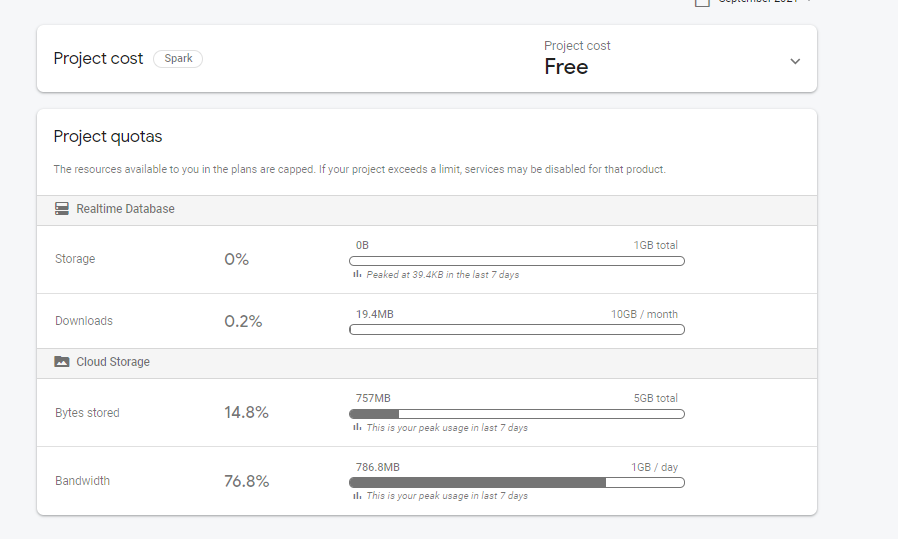
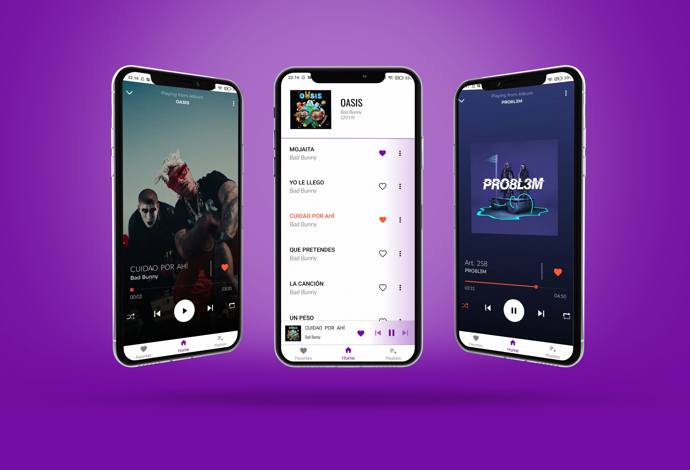
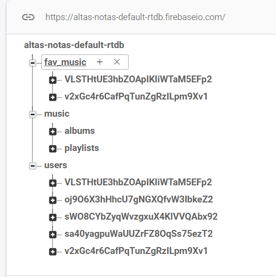
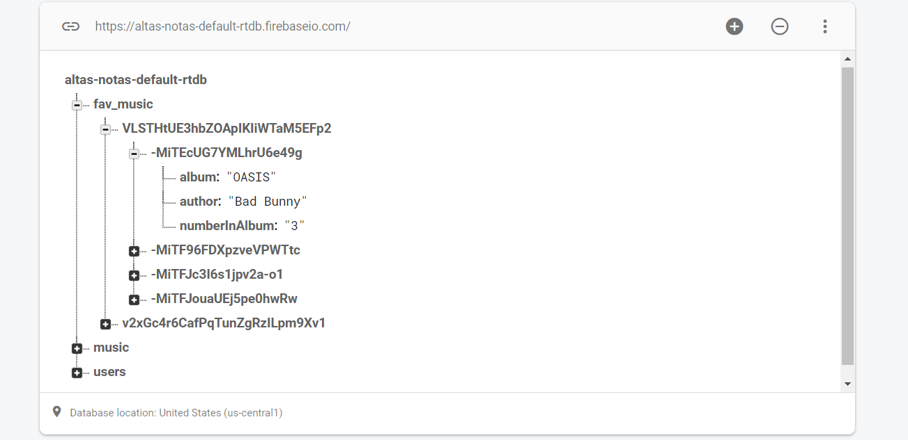

  

# 🎵  Altas-Notas
Music Player based on Firebase Services

## 💻 Progress
 
 
 
 
 
  

## 👾 Tech Stack
* Java
* MVVM
* Firebase services
* ExoPlayer
* Foreground Service
* Facebook login integration 
* Google login integration 
* ViewBinding 
  
  

## 🎥 Preview

  
  

## 🚀 v2.0
* SearchView connected with Albums and Songs from Firebase
* Change songs by Swipe
* Short links of Songs (Firebase dynamic links)
* Two Themes
* Last albums played
* Navigation Component
* Edit Playlist's Title and Description
* Sorting Song Order in Playlist
* Custom Progress bar's while fetching Firebase Data
* Artist Page
* Multiple Artist's at same song
* Different Layout for different phone's

  

## ⚠️  Warning

This Project is currently limited by Firebase download bandwith 
as seen image below

 Becouse of this App may not be working correctly If Bandwith is used.

  

  

## 🌊 Instalation 

  

### Setup[0] -  Run this project in Your envoirment
 

If You want to recreate my project in Your own envoirment,

Copy link and open Android Studio. Click 'Get from Version Control' and paste link to automaticly download project.

After that import full folder to Your Android Studio

  

You need's to add new file ( google-services.json ) which allows connection with Firebase services. 

For security reasons I let this file hidden.

Tutorial how to connect it : <a href="https://firebase.google.com/docs/android/setup"> ✨ Tutorial ✨ </a>

   
### Setup[1] - Realtime DB

In 4 different picture's I want to show how I made DB structure

  

 
 
Photo above show's summary structure. I divided data to those catagories. 

  

  

 

Every song that is added to favorites list is added to List where title of List is ID of current user. 

Every song here have different ID make randomly  

  

  

  
 
Here's how I store album data. It only part which You Have to COPY

 
Without filling at least one album in Your DB, There will be none to download from.

   

  

  
 
Thats how every song look like. Their dir name is irrevelant. 

 
Most important is their 3 (or 4 sometimes) values 

 
 *  title
 *  order
 *  path
 *  videoPath 

videoPath doesnt always need to be, but if present - music player will play this video in Background

   

## 📈 Stats
<a href="https://api.codetabs.com/v1/loc?github=polonez-byte-112/Altas-Notas">Click here for code stats</a>

##   License

